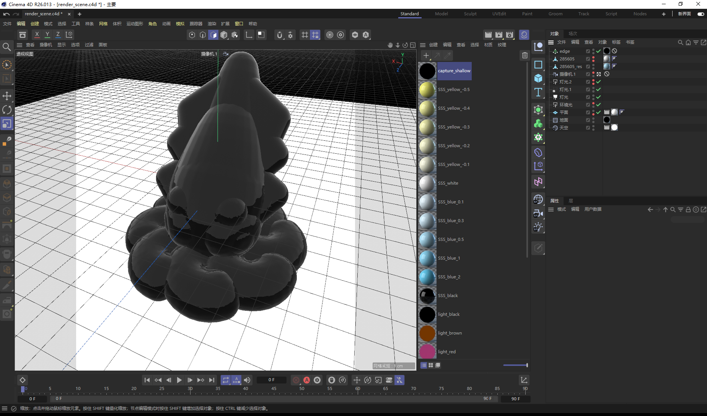
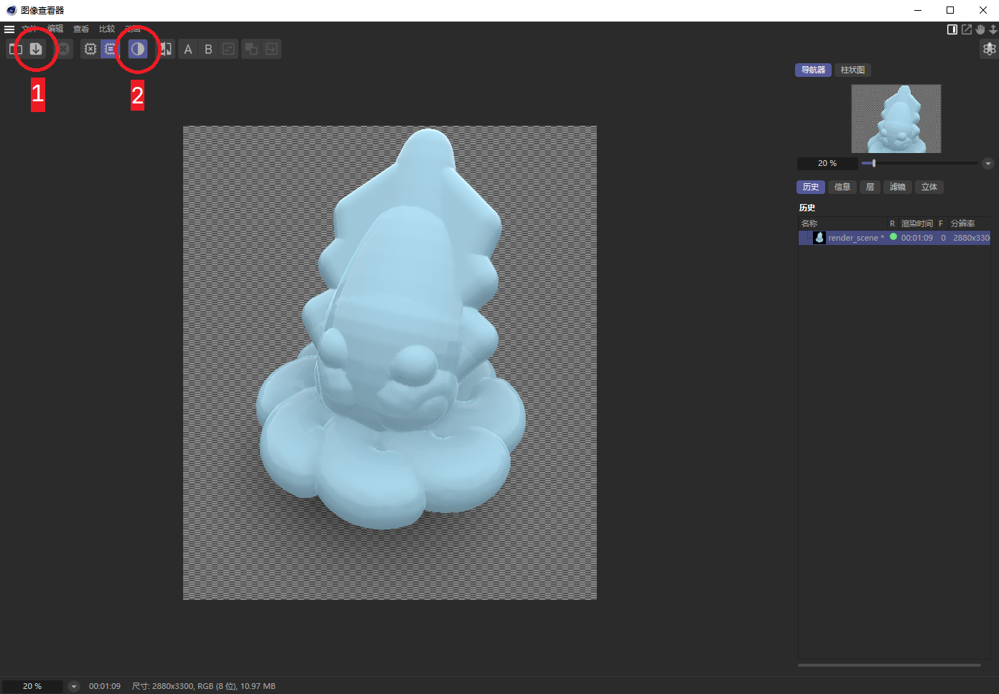
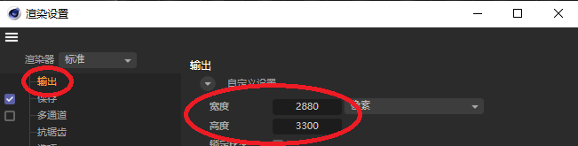
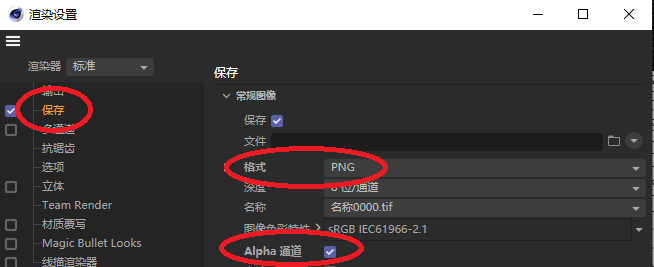
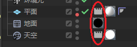
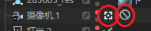
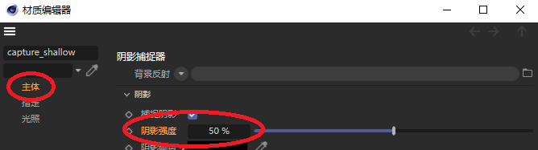

# C4D render scene

Canjia Huang <<canjia7@gmail.com>> last update 25/2/2025

这是一个在 **Cineme 4D** 中使用的渲染场景，包含常用的（好看的）材质，已调整好和渲染相关的属性设置，只需放置好网格模型并根据需要对场景进行微调即可

- 软件版本：Cinema 4D R26.013
- 系统平台：Windows 10

:bulb: 由于 **Cinema 4D** 大版本之间的差异较大，该 render scene 可能不一定适应所有版本，如果有适配性的问题，欢迎在 issues 中提出

# Quick start

打开该目录下的 [**render_scene.c4d**](render_scene.c4d) 文件，界面如下：

直接使用快捷键 `Shift + R` 渲染该场景到图像查看器，渲染完毕后界面如下：

- 使用 `按钮1` 可以保存该渲染图像，建议保存为 .png 格式，以保留图像的透明度
- 使用 `按钮2` 可以改变当前图像查看器是否启用图像透明度（仅针对查看，对保存图像是否包含透明度信息没有影响）

渲染结果见 teaserfigure left

# 案例 1（透明模型渲染）

操作步骤：
1. 将材质球 **transparent_blue** 拖动到模型 **285605_res** 的材质上，进行材质替换
2. 分别点击模型 **285605** 的两个小红点（以改变该模型的可见性、可渲染性）
3. 使用快捷键 `Shift + R` 渲染该场景到图像查看器

渲染结果见 teaserfigure mid

# 案例 2（网格边渲染）

操作步骤：
1. 按住 `Ctrl` 的同时将模型 **285605_res** 拖动到晶格对象 **edge** 上，以创建模型的复制并添加晶格效果
2. 使用快捷键 `Shift + R` 渲染该场景到图像查看器

:bulb: 晶格效果是将作用对象的顶点使用球体替代，边用圆柱替代，可以渲染出网格边

如果需要调整边的大小，可以在 `晶格对象—对象` 中调整圆柱的半径

渲染结果见 teaserfigure right

# 一些细节

1. 如果需要调整渲染的图片大小，可以使用快捷键 `Ctrl + B` 调出渲染设置，可以调整渲染图片的像素大小：

    

2. 渲染设置左侧菜单中选择 `保存` 可以改变渲染后保存的图像的设置，这里勾选 :white_check_mark: 上了 **Alpha通道**，以使得渲染的图片包含透明信息（当然，保存格式需要是 .png）

    

3. 该 render scene 中给予了 **地面** 对象 **capture_shallow** 材质，以使得该地面仅接收阴影信息，而不实际渲染到摄像机中；给予了 **天空** 对象 **合成标签**，以设置其仅参与模型表面的反射，而不实际渲染到摄像机中

    

4. 为了防止误移动摄像机，给予了摄像机 **保护标签**，如果需要调整视角，可以点击摄像机对象右边的白色正方形按钮，以退出当前摄像机视角；如果需要调整摄像机位置，可以先删除 **保护标签**，再进行调整

    

5. 模型实际产生的阴影由多个因素共同决定（灯光、反射、地面位置、材质强度等），如果想要简单地调整阴影强度，可以双击打开材质球 **capture_shallow**，在 **主体** 菜单中修改 **阴影强度** 值
   
   